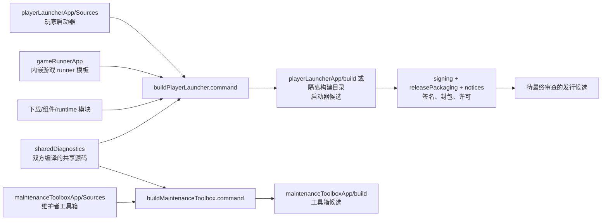

# 项目地图：第五人格启动器 · IdentityV Launcher

先读[项目首页](README.md)了解两款 App，再看下方流程图和目录表；想学习“为什么这样组织”，接着读[工程边界](docs/engineeringDecisions.md)。准备修改玩家界面，从[playerLauncherApp](playerLauncherApp/README.md)进入；准备修改工具箱，从[maintenanceToolboxApp](maintenanceToolboxApp/README.md)进入。构建和发行要再读[发行说明](releasePackaging/README.md)。这些文档可直接阅读，`.command`、`.py` 等文件是**可执行操作**，不能当教程随手运行。

| 词 | 在本仓是什么意思 |
| --- | --- |
| 源码 | 人编写、编辑的 Swift、Go、C、脚本、资源和配置。改源码不会自动改变已安装 App。 |
| 构建脚本 | 将源码与指定输入组合为候选的可执行 `.command` 文件；有些脚本会启动游戏、修改安装态或请求管理员授权，需看用途表。 |
| 构建产物／候选 | `build/`、`.build/` 里的 `.app`、二进制或 DMG；本地候选不等于已安装版或公开发布物。 |
| 运行时 | 游戏所需 Wine、DXMT、prefix、游戏文件与可选登录组件；仓里有来源和版本契约，用户电脑上的实际安装数据在仓外。 |
| 测试与夹具 | `Tests/`、`tests/` 中的合约检查，以及 `testFixtures/` 的合成样本；不能替代首次安装和真实对局。 |
| 发布材料 | 签名、公证后的 App/DMG、第三方许可、对应源码和哈希；与开发候选和当前 `/Applications` 安装态分开。 |

玩家桌面入口是**第五人格启动器**；`gameRunnerApp/` 是被它内嵌的游戏进程模板。维护者工具箱是另一款 App。三个名称直接说明归属；两款 App 共享源码，但不共用 App 包或安装目标。

## 顶层文件夹

| 文件夹 | 用途与重要子目录 |
| --- | --- |
| `playerLauncherApp/` | 玩家 App。`Sources/` 是界面和业务逻辑，`Resources/currentRoute.md` 是打进 App 的用户说明，`Assets/` 放图标，`Tests/` 放自检，`PromptHelper/` 和 `MicHelper/` 负责对应系统提示；`build/` 是可再生产物。 |
| `maintenanceToolboxApp/` | 维护者 App。`Sources/` 是浮窗、采集和界面，`Assets/` 放图标；`build/` 是可再生产物。 |
| `gameRunnerApp/` | 内嵌 runner 的两个历史模板 `IdentityV-Mac.app`、`IdentityV-AGTK.app` 及 `tests/`；模板的 `Contents/` 中有启动脚本、资源和受控预编译输入。`AGTK` 是历史名称，不代表当前主路线使用 Apple GPTK。 |
| `sharedDiagnostics/` | 两款 App 显式编译的健康检查、资源采样和高密度采集状态源码，包括 `DenseMonitoring.swift`。 |
| `gameDownloader/` | 游戏下载、更新和文件校验逻辑。 |
| `downloaderCoreBootstrap/` | 获取并校验网易下载核心的引导程序；不存放用户账号。 |
| `productCatalog/` | 两服及其组件的产品目录与锁定配置。 |
| `productManager/` | 按产品目录组织安装、更新、修复等流程，`fixtures/` 是测试样本。 |
| `manifestPlanner/` | 比对远端与本地文件清单，规划下载和修复。 |
| `runtimeManifest/` | Wine 运行环境目录、哈希和部署目标审计。 |
| `runtimeBootstrap/` | 取得、校验和安装共享运行环境；`releasePayloads/` 是四枚按哈希锁定的**已签补丁构建输入**，不是自动生成缓存。 |
| `idvLoginComponent/` | 可选登录组件的来源、下载与安装接入；`downloader/` 是相应源码和测试。 |
| `globalAdapter/` | 系统与游戏运行环境衔接的适配代码，`fixtures/` 用于测试。 |
| `gameActivator/` | 将焦点交给游戏的辅助程序源码。 |
| `functionKeyController/` | F 键控制辅助程序源码。 |
| `mouseAccelerationController/` | 鼠标加速度控制辅助程序源码。 |
| `inputLatencyProbe/` | 开发者输入延迟探针源码，不是玩家功能。 |
| `privilegedHelpers/` | 需要管理员授权的辅助程序及测试；运行/安装时可能改系统状态。 |
| `uninstaller/` | 产品卸载逻辑；执行时会改变用户安装数据，先读脚本。 |
| `denseMetrics/` | 高密度性能采样器源码；真实采样结果存于仓外私人目录。 |
| `wineAudioInterposer/` | Wine 音频接口补丁/插桩源码与测试。 |
| `wineAudioPatch/` | 默认输入设备相关补丁与来源核验。 |
| `wineEmojiPatch/` | 表情与文字兼容补丁；`repro/` 是复现源码和测试材料，`licenses/` 是所用数据许可。 |
| `wineKeyboardPatch/` | 键盘映射兼容补丁源码。 |
| `wineMousePatch/` | 鼠标输入兼容补丁源码。 |
| `wineNetworkInterposer/` | 网络兼容插桩源码和测试。 |
| `diagnostics/` | **只保留产品使用的诊断导出源码与合约测试**；个人日志、截图、按日期的实机记录不在本仓。 |
| `runtimeAssembly/` | 运行环境补丁 `patches/` 与隔离候选的源码/合约测试；真实本机 runtime、prefix 和旧实验现场不在本仓。 |
| `testFixtures/` | 无账号、无真实用户现场的合成测试样本。 |
| `notices/` | 第三方许可、来源及对应源码材料生成入口；`.build/` 是生成目录。 |
| `signing/` | entitlements、签名/公证脚本及说明；证书私钥留在系统安全存储，不进入 Git。 |
| `releasePackaging/` | 版本约定、DMG 封包脚本和发行说明；`build/`、`.venv/` 是本机生成目录。 |
| `docs/` | 可公开的架构、原因、取舍与验证边界说明。 |
| `local/` | 本机忽略的隔离候选与临时验证文件；不属于公开源码或已安装版。 |
| `.build/` | 构建工具自动生成的中间文件，可再生且不进入 Git。 |

## 根目录文件：先读哪些

| 文件 | 用途 |
| --- | --- |
| `README.md` | 产品、支持范围、日常构建和发行前状态的总入口。 |
| `projectMap.md` | 本页，解释当前新仓结构；顶层对象变化时一起更新。 |
| `AGENTS.md` | 本仓开发与地图维护约定。 |
| `LICENSE` | 原创代码许可证。 |
| `.gitignore` | 阻止构建缓存、个人日志和本地候选误入 Git；四枚受控 runtime 补丁刻意不忽略。 |
| `downloaderCoreComponent.json` | 网易下载核心的来源、版本与哈希锁。 |
| `idvLoginComponent.json` | 可选 IDV Login 组件的来源、版本与哈希锁。 |

## 根目录文件：构建与开发入口

默认构建只改仓内候选与临时文件，不安装到 `/Applications`；仍会覆盖相同输出目录的前次候选。特殊参数或后续 `run`、`install` 有额外效果。

| 文件 | 执行后的主要作用 |
| --- | --- |
| `devIterate.command` | 日常总入口：`build` 生成候选，`run` 构建并打开候选，`install` 构建并更新 `/Applications`。 |
| `buildPlayerLauncher.command` | 构建玩家启动器，默认写 `playerLauncherApp/build/`，自身不更新 `/Applications`。 |
| `buildMaintenanceToolbox.command` | 构建维护者工具箱到 `maintenanceToolboxApp/build/`，自身不更新 `/Applications`。 |
| `buildGameRunner.command` | 构建/装配内嵌游戏 runner 模板。 |
| `buildIdentityVGameActivator.command` | 构建游戏前台激活辅助程序。 |
| `buildIdentityVFunctionKeyController.command` | 构建 F 键辅助程序。 |
| `buildIdentityVInputLatencyProbe.command` | 构建开发者输入延迟探针。 |
| `buildIdentityVCommandGraveForwarder.command` | 构建键盘补丁；`--install-active` 特殊模式会改旧已装 App。 |
| `buildIdentityVMouseAccelerationController.command` | 构建鼠标控制程序；`--install-active` 特殊模式会改旧已装 App。 |
| `stageIdentityVAudioInterposer.command` | 构建并放置音频补丁到项目 runner 模板，可能覆盖模板内前次输出。 |
| `buildIdentityVOverlayApp.command` | 已退役的旧浮窗构建入口，目前拒绝执行；不是当前工具箱构建方法。 |

## 根目录文件：会改变运行态或安装态

这组文件不是阅读练习；实际运行前需确认对象、备份和当前游戏状态。

| 文件 | 执行后的主要作用 |
| --- | --- |
| `installIdentityVApps.command` | 按 `launcher` 或 `toolbox` 更新 `/Applications` 并备份旧 App。 |
| `installIdentityVLauncherApp.command` | 旧 `第五人格 Mac.app` 的安装入口，留作兼容/历史操作。 |
| `installIdentityVIdvLoginLauncherShim.command` | 安装或更新旧登录 shim。 |
| `installIdentityVPasswordlessHelpers.command` | 安装特权 helper 和授权配置，可能请求管理员权限。 |
| `restartIdentityVGame.command` | 停止并重启游戏，`--dry-run` 才只观察。 |
| `stopIdentityVIdvLogin.command` | 停止相关登录进程/服务，必要时提权。 |
| `stopIdentityVMonitoring.command` | 停止旧监测进程或服务。 |
| `updateIdentityVIdvLoginComponent.command` | 更新已装登录组件。 |
| `migrateIdvLoginHotfixState.py` | 迁移旧登录组件热修状态，会写本机数据。 |
| `restoreFunctionKeys.command` | 恢复或调整本机 F 键状态。 |
| `enableMetalHudForNextLaunch.command` | 写入下一次游戏启动的 Metal HUD 设置。 |
| `disableMetalHud.command` | 清除或关闭 Metal HUD 设置。 |

## 根目录文件：观察

| 文件 | 执行后的主要作用 |
| --- | --- |
| `captureIdentityVDenseMetrics.command` | 采集活动游戏的高密度性能指标并写私人文件；不安装玩家 App。 |

本页是**新产品仓**的当前结构清单。私人项目档案可说明过去的完整目录和原始现场，但公开仓文档不链接私有原文或本机路径。新增、删除、改名顶层对象或改变脚本副作用时，同一变更更新本页、首页入口及相关构建脚本；生成目录只解释用途，不逐个列缓存。发布前复核顶层覆盖、相对链接与清单中的实际构建/安装行为。
